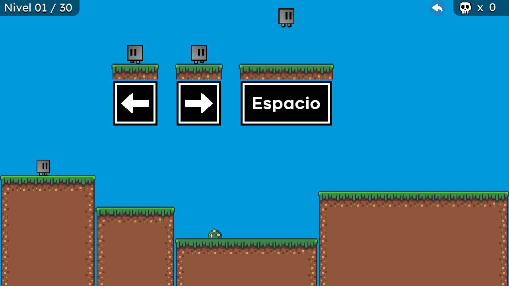
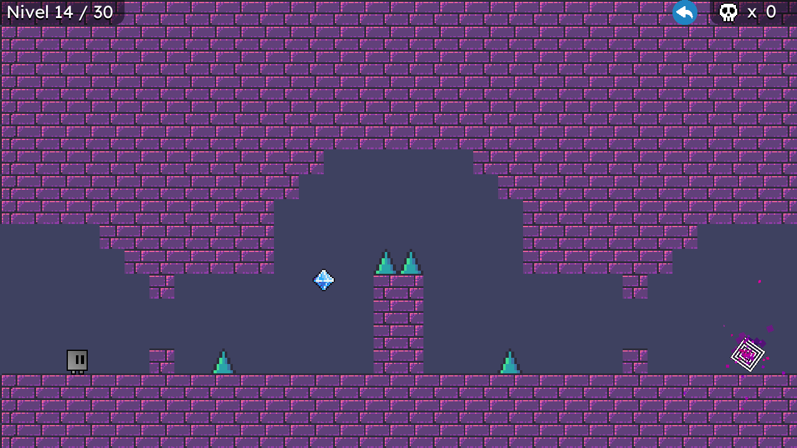
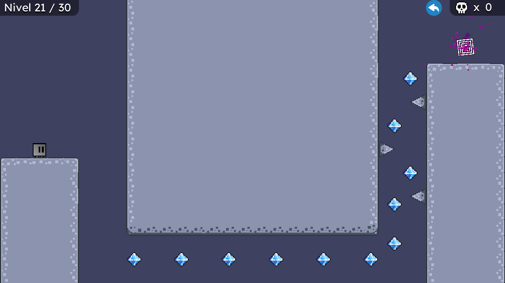

# Colorless
Videojuego de plataformas realizado por Lombardo Moreno Rodríguez utilizando Godot Engine.
  
## ~ Tecnologías usadas para la realización de este proyecto ~
GDScript
  
## ~ ¿De qué trata? ~
La historia se basa de un personaje llamado «Cuby» el cual es de color azul y en una noche tranquila es visitado por una entidad maligna que le roba su color azul. El objetivo de Cuby es pasar 30 niveles. Por cada 10 niveles pasados Cuby recupera una parte de su piel. Colorless contiene 3 mundos:
- Arrival (del 1 al 10)
  

  
- Wisdom (del 11 al 20)
  

  
- Madness (del 21 al 30)
  

  
## ~ Demostración (Walkthrough) ~
Liga para acceder al walkthrough completo de Colorless:
https://youtu.be/L8qpa3jBh58
   
# # Autor
Proyecto realizado por: Lombardo Moreno Rodríguez.
